# 8byte DevOps Intern Assignment

**Deploy a Containerized Node.js Application on AWS using Terraform and GitHub Actions**

---

## Table of Contents

- [Objective](#objective)
- [Scenario](#scenario)
- [Technology Stack](#technology-stack)
- [Project Overview](#project-overview)
- [Architecture Diagram](#architecture-diagram)
- [Task 1: Application Setup](#task-1-application-setup)
- [Task 2: Dockerize the Application](#task-2-dockerize-the-application)
- [Task 3: Infrastructure Provisioning using Terraform](#task-3-infrastructure-provisioning-using-terraform)
- [Task 4: Deploy Application on EC2](#task-4-deploy-application-on-ec2)
- [Task 5: CI/CD using GitHub Actions](#task-5-cicd-using-github-actions)
- [Task 6: Documentation](#task-6-documentation)
- [Expected Deliverables](#expected-deliverables)
- [Screenshots](#screenshots)
- [Demo](#demo)
- [Repository Structure](#repository-structure)

---

## Objective

The objective of this assignment is to evaluate your understanding of core DevOps concepts, including **Infrastructure as Code**, **containerization**, **cloud deployment**, **CI/CD automation**, and **technical documentation**.

You are required to provision cloud infrastructure using Terraform, deploy a containerized Node.js application on AWS, and automate the Docker build process using GitHub Actions.

---

## Scenario

You are provided with a simple Node.js web application. The task is to:

- Containerize the application using Docker
- Provision AWS infrastructure using Terraform
- Deploy the application on an EC2 instance
- Automate the Docker build using GitHub Actions
- Document the entire setup and deployment process

The final application must be accessible publicly using an **EC2 Public IP** or DNS.

---

## Technology Stack

| Component              | Technology              |
|------------------------|-------------------------|
| Cloud Provider         | AWS                     |
| Infrastructure as Code | Terraform               |
| Containerization       | Docker                  |
| CI/CD                  | GitHub Actions          |
| Application Framework  | Node.js (Express)       |
| Operating System       | Ubuntu 22.04 (Recommended) |

---

## Project Overview

This repository implements the full assignment flow:

- **Application:** Node.js (Express) web app serving a success message on port 3000.
- **Docker:** Multi-stage Dockerfile to build and run the app in a container.
- **Terraform:** VPC, public subnet, Internet Gateway, route table, security group (SSH + port 3000), and EC2 instance with Docker installed via `user_data`.
- **GitHub Actions:** On every push to `master`, the pipeline **builds** the Docker image and **pushes** it to Docker Hub. The Docker Hub push happens automatically when the workflow runs—no manual push required for CI/CD.
- **EC2 deployment:** After Terraform provisions the instance, you SSH in, **clone this repo**, **build** the Docker image on the instance, and **run** the container (no pull from Docker Hub).


---

## Architecture Diagram

```
┌─────────────────┐     push      ┌──────────────────┐     build & push     ┌─────────────┐
│  Developer      │ ────────────► │  GitHub          │ ──────────────────►  │ Docker Hub  │
│  (git push)     │               │  Actions (CI/CD)  │   (on push to master) │ (registry)  │
└─────────────────┘               └──────────────────┘                       └─────────────┘

┌───────────────────────────────────────────────────────────────────────────────────────────┐
│  AWS (Terraform)                                                                           │
│  ┌─────────────┐   ┌─────────────┐   ┌─────────────────────────────────────────────────┐  │
│  │ VPC         │   │ Public      │   │ EC2 (Ubuntu 22.04)                                 │  │
│  │ 10.0.0.0/16 │   │ Subnet      │   │ • user_data: install Docker                        │  │
│  │ + IGW        │   │ 10.0.1.0/24│   │ • clone repo → docker build → docker run           │  │
│  └─────────────┘   └─────────────┘   │ • SG: SSH (22), App (3000)                         │  │
│                                       └─────────────────────────────────────────────────┘  │
└───────────────────────────────────────────────────────────────────────────────────────────┘
        │
        │ http://<EC2-PUBLIC-IP>:3000
        ▼
   End User (Browser)
```

---

## Task 1: Application Setup

**Requirements:**

- Install dependencies
- Run the application locally
- Verify that the application is accessible at **http://localhost:3000**

**Steps to run the application locally:**

1. **Clone the repository**
   ```bash
   git clone https://github.com/Debjyoti2004/8byte-intern-assignment
   cd 8byte-intern-assignment
   ```

2. **Install dependencies and start**
   ```bash
   cd app
   npm install
   npm start
   ```

3. **Verify**
   - Open [http://localhost:3000](http://localhost:3000)
   - You should see: **8byte Intern Assignment Successfully Deployed**

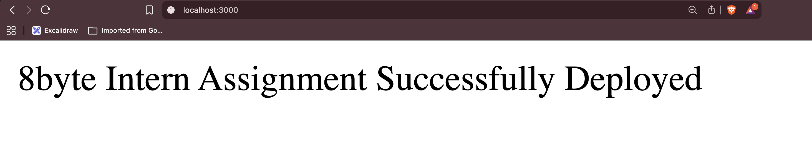

---

## Task 2: Dockerize the Application

A Dockerfile containerizes the Node.js application.

**Dockerfile requirements (met):**

- Use an official Node.js base image
- Copy application files into the container
- Install dependencies
- Expose port 3000
- Run the application using Node.js

**Verification commands (run from the `app` directory):**

```bash
cd app
docker build -t 8byte-intern-app .
docker run -p 3000:3000 8byte-intern-app
```

The application should be accessible at **http://localhost:3000**.

**Screenshots:**

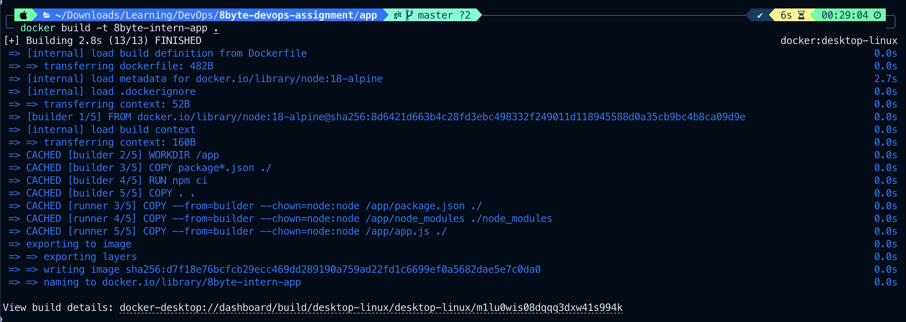

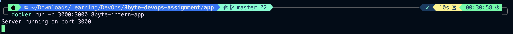

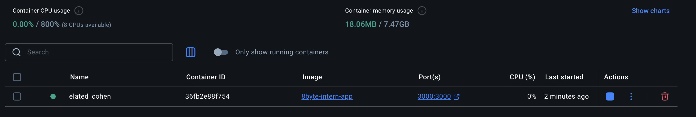

**Note:** When you push code to the `master` branch, **GitHub Actions** builds the image and pushes it to Docker Hub automatically (see Task 5). The push to Docker Hub happens at that time—no manual `docker push` is required for the pipeline.

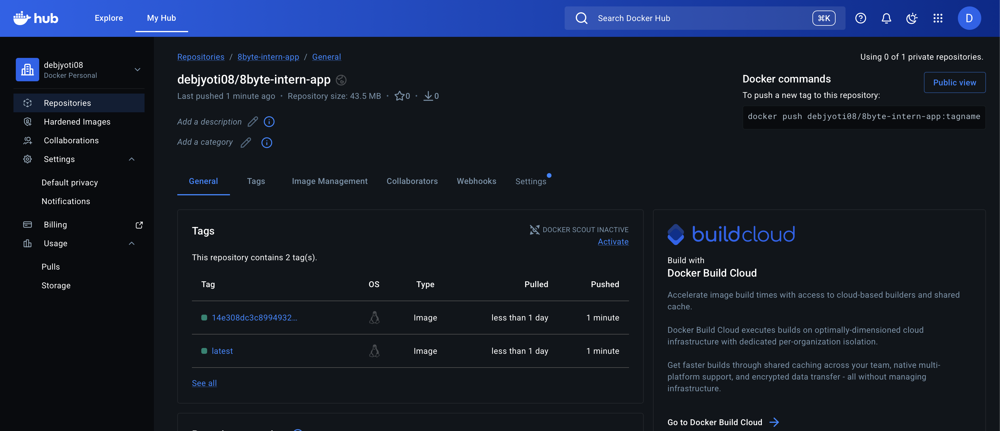

---

## Task 3: Infrastructure Provisioning using Terraform

AWS infrastructure is provisioned using Terraform.

**Required AWS resources (implemented):**

- Virtual Private Cloud (VPC)
- Public Subnet
- Internet Gateway
- Route Table and Route Table Association
- Security Group  
  - Allow SSH access on port 22  
  - Allow application access on port 3000
- EC2 Instance

**EC2 instance requirements:**

- Instance Type: t2.micro
- Operating System: Ubuntu 22.04
- Public IP enabled
- Docker installed using Terraform `user_data`
- SSH access enabled

**Terraform directory structure:**

```
terraform/
├── main.tf
├── variables.tf
├── outputs.tf
├── provider.tf
├── terraform.tfvars
└── install_docker.sh   # used in user_data
```

**Steps to provision infrastructure using Terraform:**

1. **Go to the Terraform directory**
   ```bash
   cd terraform
   ```

2. **Set variables**  
   Edit `terraform.tfvars` (or use env vars) so that:
   - `key_name` = your AWS key pair name (e.g. `AWS-key`)
   - `instance_type` = `t2.micro`
   - `ami_id` = Ubuntu 22.04 AMI for your region (e.g. `ami-019715e0d74f695be` for `ap-south-1`)

3. **Terraform commands**
   ```bash
   terraform init
   terraform plan
   terraform apply
   ```
   Type `yes` when prompted.

4. **Get the EC2 public IP**
   ```bash
   terraform output ec2_public_ip
   ```
   Use this IP for SSH and for accessing the app at `http://<EC2-PUBLIC-IP>:3000`.

**Screenshots:**

| Step | Screenshot |
|------|------------|
| Terraform apply (1) | 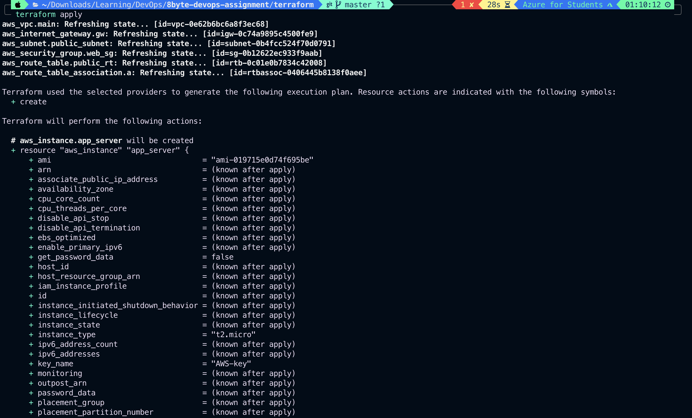 |
| Terraform apply (2) | 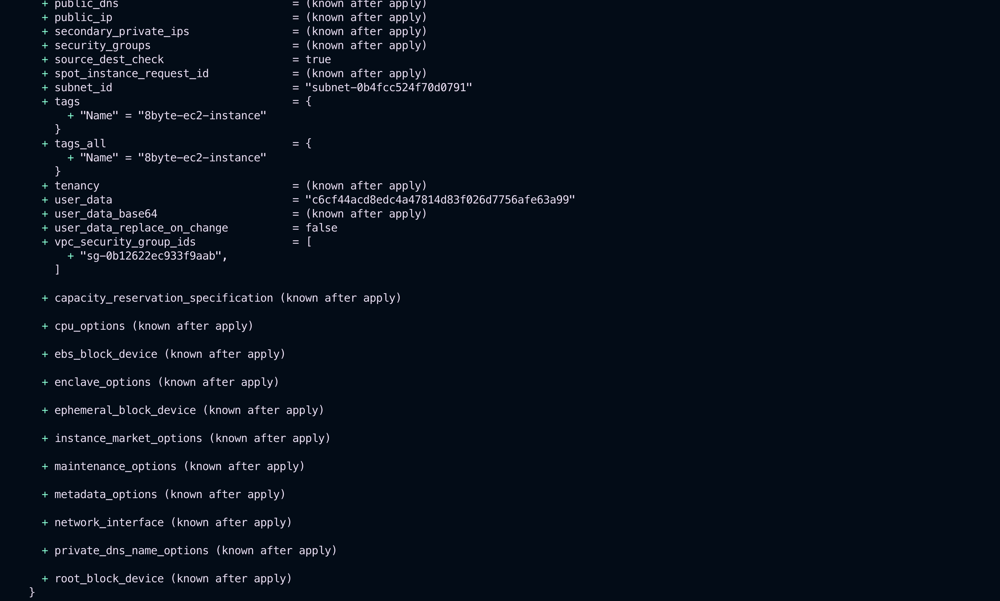 |
| Terraform apply (3) | 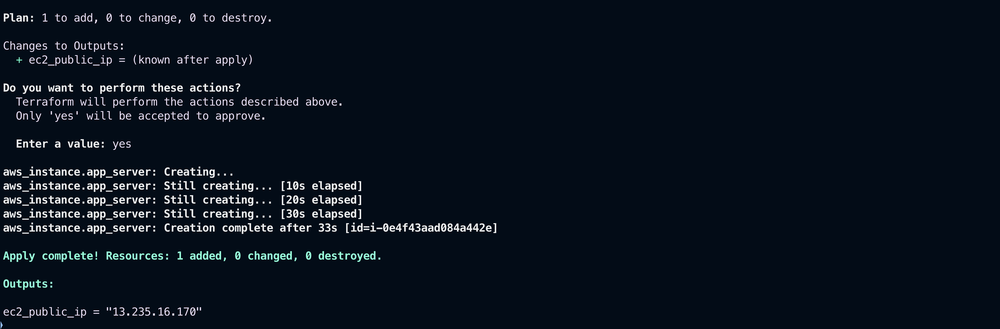 |

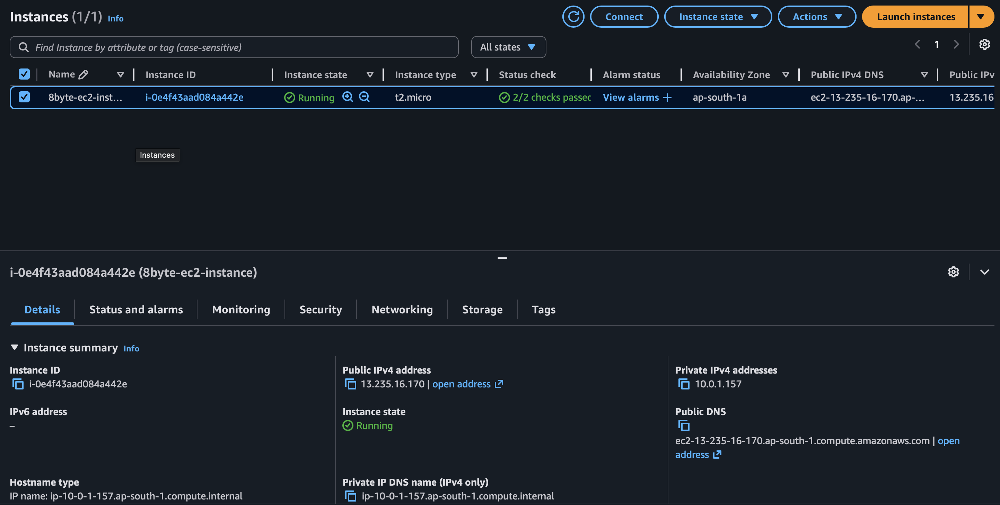

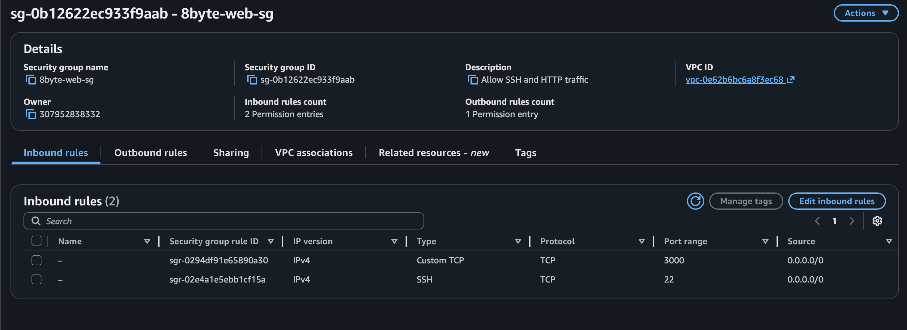

---

## Task 4: Deploy Application on EC2

After Terraform has created the EC2 instance and Docker is installed (via `user_data`):

- SSH into the EC2 instance
- Verify Docker is installed and running
- **Clone the repository**, **build** the Docker image on the instance, and **run** the container

**Steps to deploy application on EC2:**

1. **SSH into the EC2 instance** (use the key file matching `key_name` in `terraform.tfvars`):
   ```bash
   ssh -i /path/to/your-key.pem ubuntu@<EC2_PUBLIC_IP>
   ```

2. **Verify Docker**
   ```bash
   sudo docker --version
   ```

3. **Clone the repository**
   ```bash
   git clone https://github.com/Debjyoti2004/8byte-intern-assignment
   cd 8byte-intern-assignment/app
   ```

4. **Build the Docker image**
   ```bash
   docker build -t 8byte-intern-app .
   ```

5. **Run the Docker container**
   ```bash
   docker run -p 3000:3000 8byte-intern-app
   ```
   (To run in background: `docker run -d -p 3000:3000 --name 8byte-app 8byte-intern-app`)

6. **Verification**  
   The application must be accessible via:
   ```
   http://<EC2-PUBLIC-IP>:3000
   ```
   You should see: **8byte Intern Assignment Successfully Deployed**.

**Screenshots:**

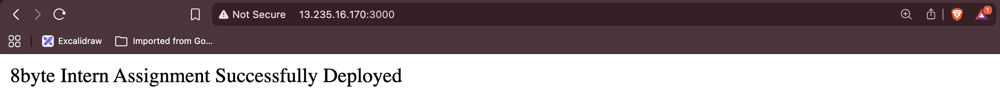


---

## Task 5: CI/CD using GitHub Actions

A GitHub Actions pipeline automates the Docker build (and push to Docker Hub).

**Pipeline requirements:**

- Trigger on push to the main/master branch
- Build Docker image
- Verify Docker image builds successfully
- **Bonus:** Push Docker image to Docker Hub ✅

**When you push to `master`:** The workflow runs, builds the image from `./app`, and **pushes** it to Docker Hub. So the Docker Hub push happens at the time of the GitHub Action run—not by manually running `docker push` locally.

**Workflow file:** `.github/workflows/ci.yml`

**Steps in the pipeline:**

| Step | Action | Purpose |
|------|--------|---------|
| Checkout | `actions/checkout@v4` | Get repository code |
| Set up Docker Buildx | `docker/setup-buildx-action@v3` | Enable build features |
| Login to Docker Hub | `docker/login-action@v3` | Use `DOCKER_USERNAME` and `DOCKER_PASSWORD` secrets |
| Build and Push | `docker/build-push-action@v5` | Build from `./app`, push to Docker Hub |

**Required GitHub secrets:**

- `DOCKER_USERNAME` — Docker Hub username
- `DOCKER_PASSWORD` — Docker Hub password or access token

**Tags pushed to Docker Hub:** `$DOCKER_USERNAME/8byte-intern-app:latest` and `$DOCKER_USERNAME/8byte-intern-app:$GITHUB_SHA`

**Screenshot:**

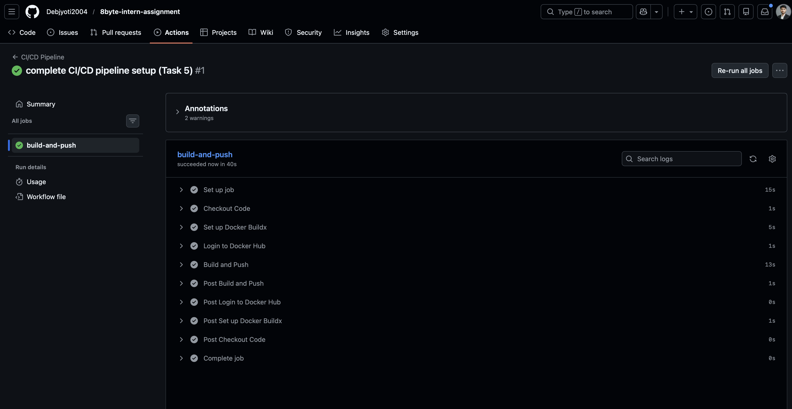

---

## Task 6: Documentation

This README provides the required documentation:

- ✅ Project overview
- ✅ Architecture diagram
- ✅ Steps to run the application locally
- ✅ Steps to build Docker image
- ✅ Steps to provision infrastructure using Terraform
- ✅ Steps to deploy application on EC2
- ✅ Explanation of GitHub Actions workflow
- ✅ Screenshots of successful deployment

Additional docs: [APPROACH.md](APPROACH.md) (design and approach), [CHALLENGES.md](CHALLENGES.md) (technical challenges and solutions).

---

## Expected Deliverables

### 1. GitHub Repository

- [https://github.com/Debjyoti2004/8byte-intern-assignment](https://github.com/Debjyoti2004/8byte-intern-assignment)

Contents:

- ✅ Application source code (`app/`)
- ✅ Dockerfile (`app/Dockerfile`)
- ✅ Terraform configuration (`terraform/`)
- ✅ GitHub Actions workflow (`.github/workflows/ci.yml`)
- ✅ README.md documentation

### 2. Public Application URL or EC2 Public IP

**Application URL:** `http://<EC2-PUBLIC-IP>:3000`  

*(Add your EC2 public IP here after deployment, e.g. `http://13.xxx.xxx.xxx:3000`)*

---

## Screenshots

| Deliverable | Screenshot |
|-------------|------------|
| Terraform apply output |    |
| Running EC2 instance |  |
| Application working in browser | 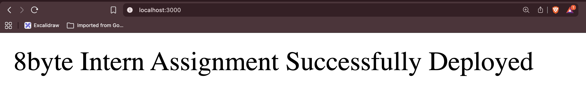 |
| Successful GitHub Actions pipeline |  |
| Docker build / run / Docker Hub |    |
| Security group |  |
| App deployed on EC2 |  |

---

## Demo

A short demo of how the assignment works (setup → Docker → Terraform → deploy on EC2 → CI/CD) is available here:

**[Add your demo video or walkthrough link here]**

---

## Repository Structure

```
.
├── README.md
├── APPROACH.md
├── CHALLENGES.md
├── .github/
│   └── workflows/
│       └── ci.yml          # GitHub Actions: build & push to Docker Hub
├── app/
│   ├── app.js
│   ├── package.json
│   ├── package-lock.json
│   ├── Dockerfile
│   └── .dockerignore
├── terraform/
│   ├── main.tf
│   ├── variables.tf
│   ├── outputs.tf
│   ├── provider.tf
│   ├── terraform.tfvars
│   └── install_docker.sh
└── public/                  # Screenshots
    ├── terraform_apply-1.png
    ├── terraform_apply-2.png
    ├── terraform_apply-3.png
    ├── app_ec2.png
    ├── app_check_from_docker.png
    ├── cicd_pipeline.png
    └── ...
```

---


*8byte DevOps Intern Assignment — Node.js, Docker, Terraform, GitHub Actions.*
